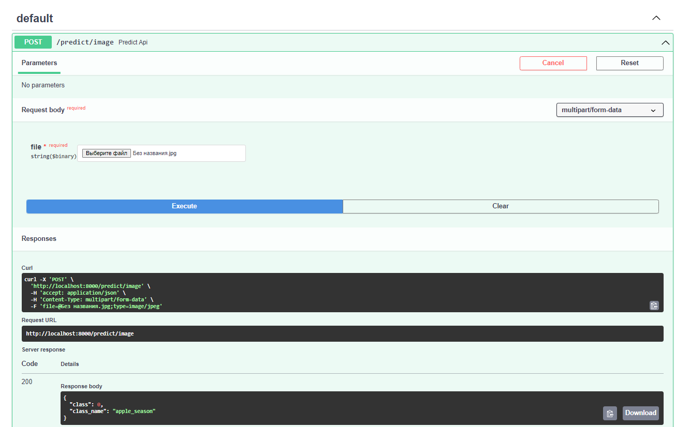

# fruits-classification

fruits-classification docker container based on FastAPI, that can predict class of your uploaded image.

Supported classes now: apple_season, lemon, persimmon, qiwi, tomato

## Getting Started

These instructions will cover usage information and for the docker container 

### Prerequisities


In order to run this container you'll need docker installed.

* [Windows](https://docs.docker.com/windows/started)
* [OS X](https://docs.docker.com/mac/started/)
* [Linux](https://docs.docker.com/linux/started/)

### Usage

#### Container Parameters

List the different parameters available to your container

```shell
docker build fruits-classification .
docker run -dp 8000:8000 fruits-classification
```

#### Example of work




#### Useful File Locations

* `/src/` - Source scripts
  
* `/notebooks/` - Notebooks with EDA and train


## Authors

* **Abapolov Filipp** - *Dev* - [pheepa](https://github.com/pheepa)
* **Stovbun Ilya** - *Manager* 